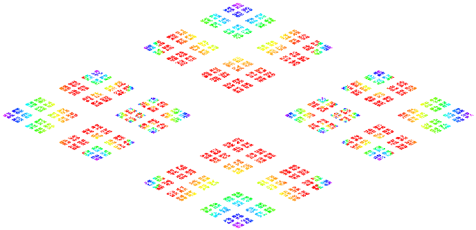

### Chaos Game is a "fractal player" on Javascript.

[Click this link and play "Chaos Game" on your computer](https://foobar167.github.io/page/chaos-game/chaos-game.html)

Run HTML file and control fractal drawing with your keyboard.

Can pause, resume, forward and backward the random fractal drawing
with {Space}, →, ←, ↑, ↓ keys on the keyboard.

Turn on/off color mode with {1} and {2} keys.

Black-and-white drawing is faster,
but colored drawing is more beautiful.

