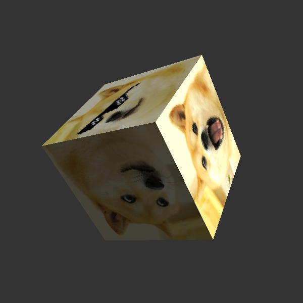

### WebGL Cube

[Click this link to show WebGL 3D cube](https://foobar167.github.io/page/webgl-cube/cube.html)

WebGL is using:
1. Javascript programming language;
2. basics of HTML and CSS necessary to start examples;
3. [glMatrix](http://glmatrix.net) high performance vector and matrix
math library.

